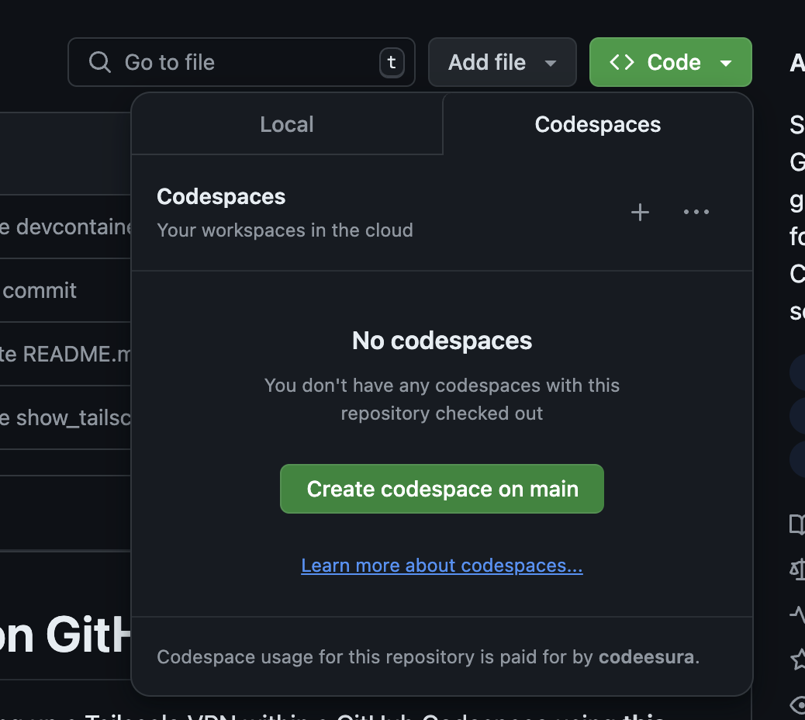
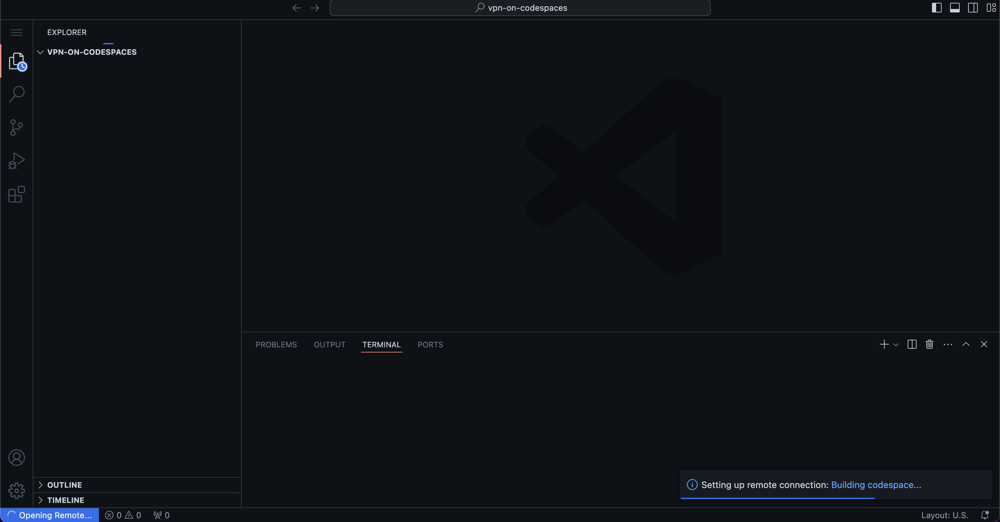
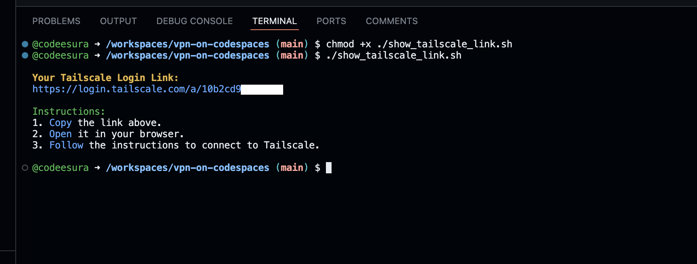
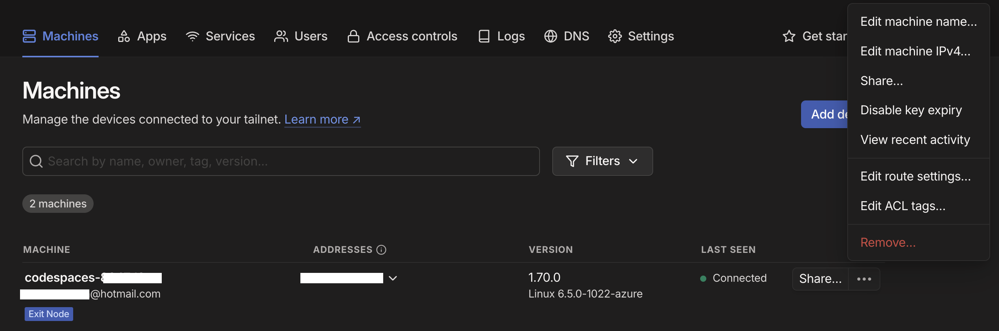
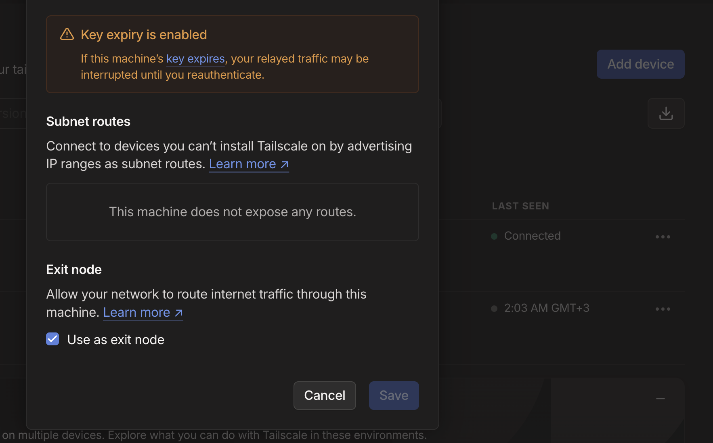

# Setting Up Tailscale VPN on GitHub Codespaces

This guide will walk you through the process of setting up a Tailscale VPN within a GitHub Codespace using **this specific repository**. It covers everything from forking the repository to configuring your Codespace with Tailscale.

By the end of this guide, you'll have a fully functional VPN running on your GitHub Codespace, accessible from anywhere.

## Table of Contents
1. [Prerequisites](#prerequisites)
2. [Step 1: Forking the Repository](#step-1-forking-the-repository)
3. [Step 2: Creating a GitHub Codespace](#step-2-creating-a-github-codespace)
4. [Step 3: Running the Setup Script](#step-3-running-the-setup-script)
5. [Step 4: Configuring Tailscale as an Exit Node](#step-4-configuring-tailscale-as-an-exit-node)
6. [Conclusion](#conclusion)

## Prerequisites

Before we start, ensure you have the following:

- A GitHub account
- Access to GitHub Codespaces (requires a GitHub account with Codespaces enabled)
- [Tailscale](https://tailscale.com) account

## Step 1: Forking the Repository

To create a Tailscale VPN in a Codespace, you'll need to fork **this repository**:

1. Go to **[this repository](https://github.com/codeesura/vpn-on-codespaces)** that contains the necessary configuration files.
2. Click on the **Fork** button at the top-right of the page.
3. Choose your GitHub account as the destination for the fork.

## Step 2: Creating a GitHub Codespace

Now that you have the repository forked, you can create a Codespace:

1. Navigate to your forked repository on GitHub.
2. Click on the **Code** button and select **Codespaces**.
3. Click **Create codespace on main**.



5. Wait for the Codespace environment to initialize. This may take a few minutes.



## Step 3: Running the Setup Script

Once your Codespace is ready, you'll need to run the provided setup script to configure Tailscale:

1. Open the terminal in your Codespace.
2. Grant execute permissions to the setup script:

    ```bash
    chmod +x ./show_tailscale_link.sh
    ```

3. Run the script using:

    ```bash
    ./show_tailscale_link.sh
    ```

4. The script will output a link. Follow the link to log in to your Tailscale account and register your machine.



## Step 4: Configuring Tailscale as an Exit Node

After logging in and registering your machine, follow these steps to set your Codespace as an exit node:

1. Go to the [Tailscale admin panel](https://login.tailscale.com/admin/machines).
2. Navigate to the `Machines` section and find your Codespace instance.
3. Click the three dots (•••) next to your Codespace instance and select `Edit route settings`.



4. In the route settings menu, enable the `Use as exit node` option.



## Conclusion

Congratulations! You've successfully set up a Tailscale VPN on your GitHub Codespace. This setup allows you to securely access your development environment from anywhere.

Feel free to customize and extend this setup according to your needs. Happy coding!
